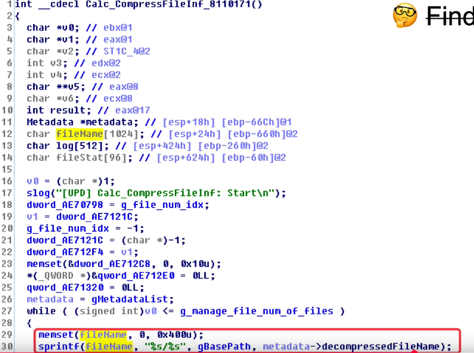
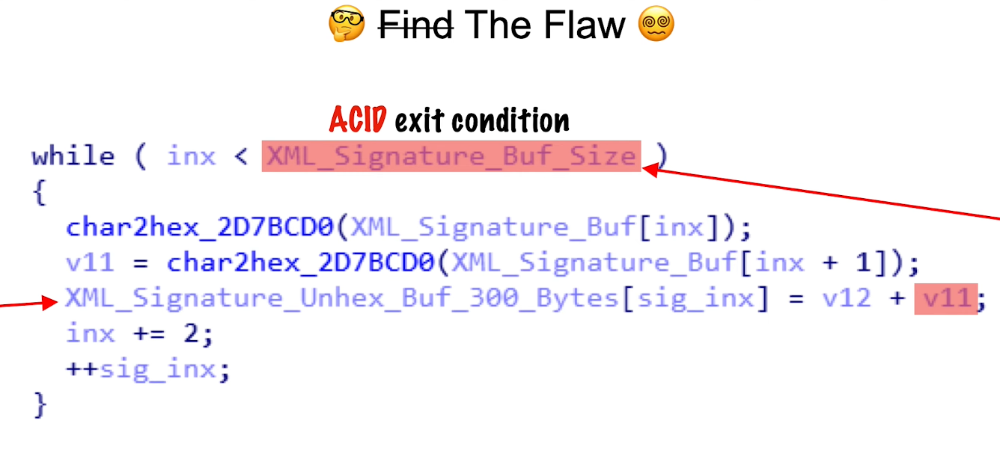

# 01
# Vulnerability Types
- Heap out of bounds
- Use after free
- Type confusion
- Uninitialized use 

# Terms
## ACID (Attacker Controlled Input Data)
- ACID is a term used to describe the input data that an attacker can control.
## Shellcode 
- Shellcode means a piece of code that an attacker wants user to execute.
## Exploit Primitives
- Exploit primitives are the basic building blocks of an exploit. They are the fundamental techniques that an attacker can use to gain control of a system or application.
### Example 
- Overwrite of return address
- Overwrite of other local variables
- Overwrite of heap data
## Exploit Chain
- This means that an attacker can use multiple exploit primitives together to create a more complex exploit.
## Zero Day
- A zero-day vulnerability is a security flaw that is unknown to the vendor and has not been patched. Attackers can exploit these vulnerabilities before the vendor releases a fix, making them particularly dangerous.
## N-day
- An N-day vulnerability is a security flaw that has been publicly disclosed and for which a patch is available. Attackers can exploit these vulnerabilities if users do not apply the patch in a timely manner.
## Attack Surface
- The attack surface is the totality of all the points in a system that an attacker can use to gain access to the system. This includes all the inputs, outputs, and interfaces that an attacker can use to interact with the system.

## Sploity Sens
- Sploity sens is a term used to describe when an vulnerability hunters develop a 6 sence to detect vulnerabilities. When they see so many vulnerabilities, they start to see patterns and can identify potential vulnerabilities more easily.
## Words of Power
1. Parse
2. Decode
3. Convert
4. Deserialize
5. Interpret
6. Decompress
## Program Paranoid
- If you are not paranoid they ara out the get you.

# 02
## Stack Buffer Overflow
### What is a stack buffer overflow?
- A stack buffer overflow is a type of vulnerability that occurs when a program writes more data to a buffer on the stack than it can hold. This can lead to overwriting adjacent memory locations, including the return address of a function, which can allow an attacker to execute arbitrary code.
### Common causes of stack buffer overflows
- Using unsafe functions like `strcpy`, `strcat`, and `sprintf` that do not check the size of the destination buffer.
- Sequentially data writes with in a loop with an ACID loop condition.
``` c
#include <stdio.h>
#include <string.h>

int main(int argc, char *argv[])
{
		char buffer[8];
		strcpy(buffer, argv[1]); // Vulnerable to stack buffer overflow
		printf("Buffer: %s\n", buffer);
}
```


- This code take argument from the command line and copy it to a buffer of size 8. If the user provides an input longer than 8 characters, it will overflow the buffer and overwrite the return address of the function.


# CVE-2021-21574
## CVE-2021-21571 
- is a vulnerability in the DELL Bios auto update future. This future reaches out to the internet and downloads a file and its ssl serticate is accept wildcard certificate. This couses an ACID vulnerability. The attacker can create a fake ssl sertificate and the bios will accept it. This couses a buffer overflow in the bios and the attacker can run code in the bios.

## CVE-2021-21574
- The vulnerability in the https couses some other vulnerabilities.

``` c
// Pseudocode derived from assembly

idx = 0;
write_ptr = buf_on_stack; //rbp-0x158
while(1) {
    if (idx >= strnlen (hex_ptr, 20000))
        break;
    *write_ptr++ = CONVERT_HEX(hex_ptr [idx]) << 8 |
        CONVERT_HEX(hex_ptr [idx+1]);
    idx += 2;
}

if (buf_on_stack != calculated_sha256 ) { if (memcmp(buf_on_stack, calculated_sha256, 32) )
    retval = EFI_NOT_FOUND
}
```
- The hex_ptr is ACID exit condition if you keep that value bigger than idx you can corrupt the stack.
## CVE-2018-9312
- The modern cars continuously get more relays more on the software and this causes them to be vulnerable to attacks. 
-  Some of this interfaces local (USB and ODB PORTS) and some of them are remote (INTERNET connections). 
- The ODB PORT is used to connect the car to a computer for diagnostics. This port is used by the car manufacturers to update the car's software and to diagnose problems with the car.
- In this case the NBT head unit has a usb and the vunerability is in the NBT head unit.



The file name copied by sprintf and s printf looks for null byte the buffer size is 1024 an you can exploit by make the file name bigger than 1024 bytes.

## CVE-2018-9318


- In this case the care get update by connecting to the internet its expecting an signature but when checking the signature it couses ACID exit condition and ACID data.
- The car uses RTOS and there is no stack canary protection.
