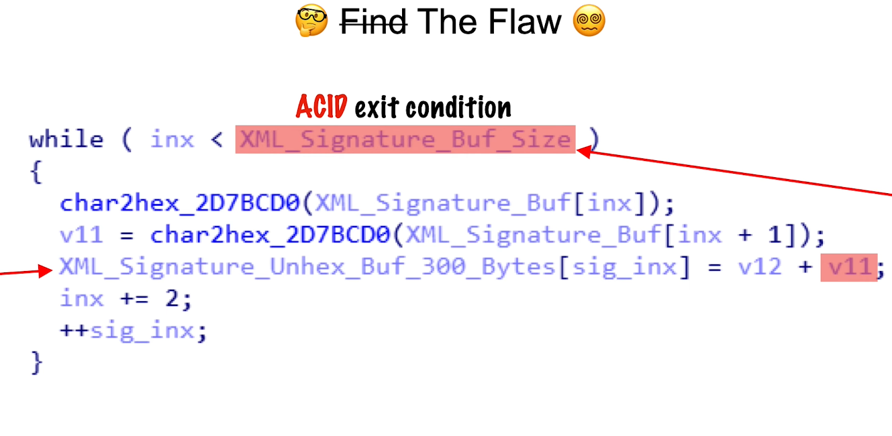

# 01 Introduction
## Vulnerability Types
- Heap out of bounds
- Use after free
- Type confusion
- Uninitialized use 

## Terms
### ACID (Attacker Controlled Input Data) tainted date
- ACID is a term used to describe the input data that an attacker can control.
### Shellcode 
- Shellcode means a piece of code that an attacker wants user to execute.
## #Exploit Primitives
- Exploit primitives are the basic building blocks of an exploit. They are the fundamental techniques that an attacker can use to gain control of a system or application.
#### Example 
- Overwrite of return address
- Overwrite of other local variables
- Overwrite of heap data
### Exploit Chain
- This means that an attacker can use multiple exploit primitives together to create a more complex exploit.
### Zero Day
- A zero-day vulnerability is a security flaw that is unknown to the vendor and has not been patched. Attackers can exploit these vulnerabilities before the vendor releases a fix, making them particularly dangerous.
### N-day
- An N-day vulnerability is a security flaw that has been publicly disclosed and for which a patch is available. Attackers can exploit these vulnerabilities if users do not apply the patch in a timely manner.
### Attack Surface
- The attack surface is the totality of all the points in a system that an attacker can use to gain access to the system. This includes all the inputs, outputs, and interfaces that an attacker can use to interact with the system.

### Sploity Sens
- Sploity sens is a term used to describe when an vulnerability hunters develop a 6 sence to detect vulnerabilities. When they see so many vulnerabilities, they start to see patterns and can identify potential vulnerabilities more easily.
### Words of Power
1. Parse
2. Decode
3. Convert
4. Deserialize
5. Interpret
6. Decompress
### Program Paranoid
- If you are not paranoid they ara out the get you.

# 02 Stack Buffer Overflow
## What is a stack buffer overflow?
- A stack buffer overflow is a type of vulnerability that occurs when a program writes more data to a buffer on the stack than it can hold. This can lead to overwriting adjacent memory locations, including the return address of a function, which can allow an attacker to execute arbitrary code.
### Common causes of stack buffer overflows
- Using unsafe functions like `strcpy`, `strcat`, and `sprintf` that do not check the size of the destination buffer.
- Sequentially data writes with in a loop with an ACID loop condition.
``` c
#include <stdio.h>
#include <string.h>

int main(int argc, char *argv[])
{
		char buffer[8];
		strcpy(buffer, argv[1]); // Vulnerable to stack buffer overflow
		printf("Buffer: %s\n", buffer);
}
```


- This code take argument from the command line and copy it to a buffer of size 8. If the user provides an input longer than 8 characters, it will overflow the buffer and overwrite the return address of the function.




## CVE-2021-21574
### CVE-2021-21571 
- is a vulnerability in the DELL Bios auto update future. This future reaches out to the internet and downloads a file and its ssl serticate is accept wildcard certificate. This couses an ACID vulnerability. The attacker can create a fake ssl sertificate and the bios will accept it. This couses a buffer overflow in the bios and the attacker can run code in the bios.

### CVE-2021-21574
- The vulnerability in the https couses some other vulnerabilities.

``` c
// Pseudocode derived from assembly

idx = 0;
write_ptr = buf_on_stack; //rbp-0x158
while(1) {
    if (idx >= strnlen (hex_ptr, 20000))
        break;
    *write_ptr++ = CONVERT_HEX(hex_ptr [idx]) << 8 |
        CONVERT_HEX(hex_ptr [idx+1]);
    idx += 2;
}

if (buf_on_stack != calculated_sha256 ) { if (memcmp(buf_on_stack, calculated_sha256, 32) )
    retval = EFI_NOT_FOUND
}
```
- The hex_ptr is ACID exit condition if you keep that value bigger than idx you can corrupt the stack.

# 03 Preventing
## Sanitization
- Sanitization is the process of creating sanity checks to ensure that the input is exactly what it is supposed to be. To do that you should create a checks or use saffer functions.
### Unsafe functions
- memcpy, strcpy, strcat, sprintf, gets, scanf, sscanf
### Safe(r) functions
- strlcpy, strlcat, snprintf, fgets, scanf_s, sscanf_s
- This functions are safer but if you use them wrong they can be unsafe.
### Misleading functions
- strncat, strncpy, snprintf
- This functions are safer but very esay to misuse.

Example:
``` c 
#include <stdio.h>
#include <string.h>
int main(int argc, char *argv[])
{
        char buffer[8];
        strncpy(buffer, argv[1], 1000); // Vulnerable to stack buffer overflow
        printf("Buffer: %s\n", buffer);
}
```
- In this case the buffer 8 bytes but the strncpy will copy 1000 bytes. This is a buffer overflow.

### FIX 
- The fix is useing safer functions or creating wraper functions that will check the size of the buffer and the size of the input for specific cases.

### FORTIFY_SOURCE
- There is some compiler flags that can help you to detect buffer overflows. The most common is FORTIFY_SOURCE. This flag will add some checks to the code and if the checks fail it will crash the program. This is not a complete solution but it can help you to detect some buffer overflows.

1. -D_FORTIFY_SOURCE=1 adds compile time checks
2. -D_FORTIFY_SOURCE=2 adds more checks incuding runtime checks 

# 04 Detection
## Reading the code
- The first step in detecting a vulnerability is to read the code. This is the most important step. You need to go with the ACID flow and see if there is any place where the input is not checked. You need to look for the following.
## Static Analysis Tools
- There are some tools that can help you to detect vulnerabilities. But they are not perfect. You need to use them with caution. Some times the can give you false positives or false negatives.
- There is an analysis of this tools. The resluts are shows they are only usefull for simple examples to just accelerate the process of finding vulnerabilities.
## Fuzzing
- Fuzzing is a technique used to find vulnerabilities by sending random data to the program and see if it crashes. This is a very effective technique but it can be time consuming. There are some tools that can help you to do this.
### Dum fuzzing
- Dum fuzzing is a technique used to find vulnerabilities by sending random data to the program and see if it crashes. This is a very effective technique but it can be time consuming.
### Template Fuzzing
- Template fuzzing is a technique used to find vulnerabilities by sending template date to the program and see if it crashes.
### Coverage Fuzzing
- Coverage fuzzing is a technique used to find vulnerabilities by sending template base data and getting some feedback from the program. And trying to go to all paths of the program. 
## Adress Sanitizer
- Address sanitizer is a tool that can help you to detect buffer overflows. It will add some checks to the code and if the checks fail it will crash the program. This is not a complete solution but it can help you to detect some buffer overflows. But it can cause some significant performance overhead.
- Useing address sanitizer with fuzzers is a good idea. Address sanitizer can find bugs but in order to trigger the bug you need to go to the path of the program. This is where fuzzers come in. Fuzzers can help you to go to the path of the program and trigger the bug.
- It can not work with fortify source you should use fortify source in production and address sanitizer in development.
# 05 Mitigation
## Stack Canaries (Stack Cookies)
- Stack canaries are a technique used to detect buffer overflows. They work by placing a random value (the canary) on the stack before the return address. If the canary is overwritten, the program will crash.
- If the attacker can have full control of the stack he can skip the canary and only overwrite the return address in that case the canary will not be usefull.
### To enable stack canaries
``` bash
gcc -fstack-protector-all -o stack_canary stack_canary.c
```
## Address Space Layout Randomization (ASLR)
- Address space layout randomization (ASLR) is a technique used to randomize the memory addresses of the program. This makes it harder for an attacker to predict the location of the return address and other important data.
### By passing the ASLR
- If the attacker have info about the some memory element and if they can read memory and find that think they can learn the ofset of the all the other elements.
## Non-Executable Memory
- After attacker overflow the buffer and owerwrite the return address it will jump back to the buffer to run his malicious code. When the buffer is not executable the attacker can not run his code. This is a very effective technique but it can be bypassed by using return oriented programming (ROP).


